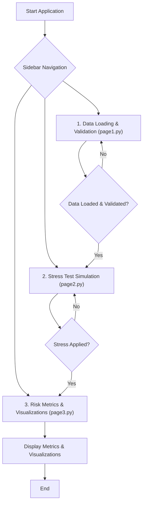

id: 687153b85887adf827c47db5_documentation
summary: Risk Management Framework Lab 1 Documentation
feedback link: https://docs.google.com/forms/d/e/1FAIpQLSfWkOK-in_bMMoHSZfcIvAeO58PAH9wrDqcxnJABHaxiDqhSA/viewform?usp=sf_link
environments: Web
status: Published
```
# Risk Management Framework Lab 1 - Stress Test Scenario Visualizer

## Overview

This codelab guides you through the architecture and functionality of a Streamlit application designed for interactive financial stress testing and visualization. You will learn how the application loads data, applies different stress scenarios, calculates key risk metrics, and generates insightful visualizations.

## 1. Introduction and Application Context
Duration: 0:05:00

This application, titled **"Risk Management Framework Lab 1 - Stress Test Scenario Visualizer"**, serves as an interactive platform for understanding and visualizing the potential impact of financial stress tests on a firm's financial health. It aims to provide financial professionals, risk analysts, portfolio managers, and regulatory compliance personnel with a dynamic tool for comprehensive risk assessment.

The core importance of this application lies in its ability to simulate and analyze the effects of various adverse conditions, aligning with concepts from financial risk management literature, such as how correlated threats can impact multiple aspects of a financial institution simultaneously.

**Key Concepts Explored:**

*   **Financial Stress Testing:** A regulatory requirement and internal risk management practice used to evaluate a firm's resilience under hypothetical adverse market conditions.
*   **Sensitivity Stress Testing:** Analyzing the impact of changes in a single financial parameter.
*   **Scenario Stress Testing:** Applying a defined set of shocks across multiple, related parameters based on a specific economic or market scenario.
*   **Firm-Wide Stress Testing:** Simulating a broad, systemic crisis impacting a wide range of financial components.
*   **Risk Capacity:** The maximum level of risk a firm can accept and absorb without breaching constraints or objectives.
*   **Key Financial Metrics:** Including Revenue, Costs, Net Earnings, Capital, and Liquidity.

**Application Objectives:**

*   Enable simulation and visualization of Sensitivity, Scenario, and Firm-Wide stress tests.
*   Facilitate understanding of the relationship between economic parameters and financial metrics.
*   Present estimated impacts on vital financial components.
*   Offer interactive visualizations of financial trajectories, correlations, and aggregated losses.

The application is structured into three main pages, accessible via the sidebar navigation, representing a typical workflow in a stress testing exercise:

1.  **Data Loading & Validation:** Prepare the baseline financial data.
2.  **Stress Test Simulation:** Apply the chosen stress methodology.
3.  **Risk Metrics & Visualizations:** Analyze the results and key metrics.

Here is a simplified flow diagram illustrating the application's structure:



The main `app.py` file sets up the Streamlit page configuration, displays the title and introductory markdown, and then uses the sidebar selectbox to dynamically import and run the appropriate page function from the `application_pages` directory based on user selection.

```python
# app.py
import streamlit as st
# Set basic page configuration
st.set_page_config(page_title="QuLab", layout="wide")
# Display sidebar content
st.sidebar.image("https://www.quantuniversity.com/assets/img/logo5.jpg")
st.sidebar.divider()
# Display main content
st.title("QuLab")
st.divider()
st.markdown(r"""
# ... introductory text and objectives ...
""")

# Sidebar navigation logic
page = st.sidebar.selectbox(label="Navigation", options=["1. Data Loading & Validation", "2. Stress Test Simulation", "3. Risk Metrics & Visualizations"])

# Route based on sidebar selection
if page == "1. Data Loading & Validation":
    from application_pages.page1 import run_page1
    run_page1()
elif page == "2. Stress Test Simulation":
    from application_pages.page2 import run_page2
    run_page2()
elif page == "3. Risk Metrics & Visualizations":
    from application_pages.page3 import run_page3
    run_page3()
```

<aside class="positive">
<b>Tip:</b> Streamlit's `st.session_state` is crucial for sharing data (like the loaded base data or stressed data) between different pages or reruns of the application.
</aside>

## 2. Data Loading and Validation
Duration: 0:10:00

This step focuses on the functionality implemented in `application_pages/page1.py`. The primary goal is to load either synthetic demo data or user-uploaded data and ensure it meets the minimum requirements for the subsequent stress testing steps.

The core logic resides in the `load_and_validate_data` function:

```python
# application_pages/page1.py
import streamlit as st
import pandas as pd

def load_and_validate_data(uploaded_file):
    """
    Loads and validates financial data from an uploaded file or returns synthetic data.
    ...
    """
    if uploaded_file is None:
        # Provide synthetic data if no file is uploaded (demo mode)
        data = {
            'Date': ['2024-01-01', '2024-01-02', '2024-01-03', '2024-01-04', '2024-01-05'],
            'Base_Revenue': [100, 110, 105, 115, 120],
            'Base_Costs': [50, 60, 55, 65, 70]
        }
        df = pd.DataFrame(data)
    else:
        try:
            # Attempt to read the uploaded CSV file
            df = pd.read_csv(uploaded_file)
        except Exception:
            # Handle file reading errors
            raise FileNotFoundError("Failed to load file. Please check file format.")

    # Define required columns
    required_cols = ['Date', 'Base_Revenue', 'Base_Costs']
    # Check if all required columns exist
    for col in required_cols:
        if col not in df.columns:
            raise KeyError(f"Required column '{col}' is missing from your data.")
    # Check for duplicate dates
    if df['Date'].duplicated().any():
        raise ValueError("Duplicate dates found in your data.")
    # Convert 'Date' column to datetime objects
    df['Date'] = pd.to_datetime(df['Date'])
    return df # Return the validated DataFrame
```

This function is critical because downstream analysis depends on correctly formatted and valid input data. It handles two cases: using built-in demo data (useful for demonstration) or processing a user-uploaded CSV file. It includes essential validation steps: checking for required columns (`Date`, `Base_Revenue`, `Base_Costs`) and ensuring dates are unique. Robust error handling is included for file loading issues, missing columns, and duplicate dates.

The `run_page1` function orchestrates the user interface and interaction for this step:

```python
# application_pages/page1.py
def run_page1():
    st.markdown(r"""
    ### 1. Data Loading and Validation
    ... explanatory text and table ...
    """)

    # Sidebar controls for data source selection
    st.sidebar.markdown("#### Data Source Selection")
    use_synthetic = st.sidebar.radio(
        "Select the data source for the stress test analysis.",
        options=["Use demo data", "Upload CSV"],
        index=0 # Default to demo data
    )

    uploaded_file = None
    if use_synthetic == "Upload CSV":
        # File uploader appears only if 'Upload CSV' is selected
        uploaded_file = st.sidebar.file_uploader(
            "Upload a CSV file containing `Date`, `Base_Revenue`, and `Base_Costs` columns.",
            type="csv",
            help="Your file must include 'Date', 'Base_Revenue', and 'Base_Costs' columns. Dates must be unique."
        )

    base_data = None
    err = None
    # Use st.spinner for visual feedback during data loading
    with st.spinner("Loading data..."):
        try:
            # Call the data loading/validation function
            base_data = load_and_validate_data(uploaded_file if use_synthetic=="Upload CSV" else None)
            st.success("Data loaded successfully.")
        except (FileNotFoundError, KeyError, ValueError) as e:
            # Capture and display specific validation errors
            err = str(e)
    if err:
        st.error(err)
        st.stop() # Stop execution if there's an error

    st.markdown("#### Data Preview")
    # Display the loaded data
    st.dataframe(base_data)

    st.markdown(r"""
    **Business Logic:**
    - Accurate, validated data is required for reliable stress scenario analysis.
    - Uploaded data must be *free from duplicates* and contain the mandatory columns.
    - All subsequent analysis will use this data as the baseline.
    """)

    # Save the loaded data to session state for use in subsequent pages
    st.session_state['base_data'] = base_data
```

The page uses a sidebar radio button to switch between demo data and file upload. An `st.file_uploader` widget is conditionally displayed. A `st.spinner` provides user feedback while `load_and_validate_data` is called. Any exceptions raised by the validation function are caught and displayed using `st.error`, halting the application flow on this page until corrected data is provided. Finally, the loaded and validated `base_data` DataFrame is stored in Streamlit's `session_state`, making it accessible to other pages in the application.

<aside class="positive">
<b>Tip:</b> Using `st.spinner` and `st.error` with `st.stop()` provides clear feedback to the user and gracefully handles data loading issues, preventing downstream errors.
</aside>

## 3. Interactive Stress Test Simulation
Duration: 0:15:00

This step, handled by `application_pages/page2.py`, allows users to define and apply different stress testing methodologies to the base data loaded in the previous step. This is where the simulation of adverse conditions happens.

The core simulation logic is within the `simulate_stress_impact` function:

```python
# application_pages/page2.py
import streamlit as st
import pandas as pd

def simulate_stress_impact(data, stress_type, parameters):
    """
    Applies stress test methodology to data.
    ...
    """
    # Create a copy to avoid modifying the original data in session state
    stressed_data = data.copy()

    if stress_type == 'Sensitivity':
        parameter_to_shock = parameters.get('parameter_to_shock')
        shock_magnitude = parameters.get('shock_magnitude') # This is a percentage (0-100)
        if parameter_to_shock not in stressed_data.columns:
             raise KeyError(f"Parameter '{parameter_to_shock}' not found in data for Sensitivity stress test.")
        # Apply percentage reduction to the selected parameter
        stressed_data[f'Adjusted_{parameter_to_shock.replace("Base_", "")}'] = (
            stressed_data[parameter_to_shock] * (1 - shock_magnitude/100)
        )
    elif stress_type == 'Scenario':
        scenario_severity_factor = parameters.get('scenario_severity_factor') # This is a factor (0.0-1.0)
        # Apply a uniform reduction factor to all 'Base_' columns
        for col in stressed_data.columns:
            if 'Base' in col:
                stressed_data[col.replace('Base', 'Adjusted')] = stressed_data[col] * (1 - scenario_severity_factor)
    elif stress_type == 'Firm-Wide':
        systemic_crisis_scale = parameters.get('systemic_crisis_scale') # This is a factor (0.0-1.0)
        # Apply a uniform reduction factor (similar to Scenario, but potentially different interpretation)
        for col in stressed_data.columns:
            if 'Base' in col:
                stressed_data[col.replace('Base', 'Adjusted')] = stressed_data[col] * (1 - systemic_crisis_scale)
    else:
        # Handle invalid stress types
        raise Exception("Invalid stress type.")

    return stressed_data # Return the DataFrame with new 'Adjusted_' columns
```

This function takes the base data, the selected stress type, and a dictionary of parameters defined by the user. It then calculates the 'Adjusted' values for relevant columns based on the chosen methodology.

The formulas used for calculating the stressed values are explicitly shown to the user in the UI:

*   **Sensitivity:** $\text{Adjusted Parameter} = \text{Base Parameter} \times \left(1 - \frac{\text{Shock Magnitude}}{100}\right)$
    *   *Explanation:* The selected parameter is reduced by the specified percentage (`shock_magnitude`).
*   **Scenario:** $\text{Adjusted Base Component} = \text{Base Component} \times (1 - \text{Scenario Severity Factor})$
    *   *Explanation:* All columns prefixed with 'Base_' are reduced by a factor based on the `scenario_severity_factor` (e.g., a factor of 0.2 means a 20% reduction).
*   **Firm-Wide:** $\text{Adjusted Base Component} = \text{Base Component} \times (1 - \text{Systemic Crisis Scale})$
    *   *Explanation:* Similar to the Scenario test, all 'Base_' columns are reduced by a factor based on the `systemic_crisis_scale`.

The `run_page2` function manages the UI for this step:

```python
# application_pages/page2.py
def run_page2():
    st.markdown(r"""
    ### 2. Interactive Stress Test Simulation
    ... explanatory text and formulas ...
    """)

    # Check if base data is available from page 1
    if 'base_data' not in st.session_state:
        st.error("No base data loaded. Please visit Page 1 and load your data.")
        st.stop() # Stop if data is missing

    # Retrieve base data from session state
    data = st.session_state['base_data']

    st.sidebar.markdown("#### Stress Test Settings")
    # Select stress test type
    stress_type = st.sidebar.selectbox(
        "Choose the stress test methodology to apply. Each type affects parameters differently.",
        options=["Sensitivity", "Scenario", "Firm-Wide"]
    )

    # Dynamically display parameter controls based on stress type
    parameters = {}
    if stress_type == "Sensitivity":
        # ... Sensitivity specific sidebar controls (select parameter, slider for magnitude) ...
        parameter_to_shock = st.sidebar.selectbox(...)
        shock_magnitude = st.sidebar.slider(...)
        parameters['parameter_to_shock'] = parameter_to_shock
        parameters['shock_magnitude'] = shock_magnitude
    elif stress_type == "Scenario":
        # ... Scenario specific sidebar controls (slider for severity factor) ...
        scenario_severity_factor = st.sidebar.slider(...)
        parameters['scenario_severity_factor'] = scenario_severity_factor
    elif stress_type == "Firm-Wide":
        # ... Firm-Wide specific sidebar controls (slider for scale) ...
        systemic_crisis_scale = st.sidebar.slider(...)
        parameters['systemic_crisis_scale'] = systemic_crisis_scale

    err = None
    stressed_data = None
    # Use spinner during simulation
    with st.spinner("Simulating stressed data..."):
        try:
            # Call the simulation function
            stressed_data = simulate_stress_impact(data, stress_type, parameters)
            st.success("Stress test applied. Preview the results below.")
        except Exception as e:
            # Handle potential errors during simulation (e.g., missing parameter column)
            err = str(e)
    if err:
        st.error(err)
        st.stop()

    st.markdown("#### Stressed Data Preview")
    # Display the resulting stressed data (includes both Base_ and Adjusted_ columns)
    st.dataframe(stressed_data)

    st.markdown(r"""
    **Business Logic:**
    - Select and customize stress events to observe their direct effect on key financials.
    - Each methodology addresses a different type of plausible risk, from targeted to systemic.
    - All downstream scenario visualizations and risk metrics will reflect these adjustments.
    """)

    # Save the stressed data and parameters to session state
    st.session_state['stressed_data'] = stressed_data
    st.session_state['stress_type'] = stress_type
    st.session_state['stress_parameters'] = parameters
```

The page first checks for the existence of `base_data` in `session_state`, stopping if it's not found. It then presents the user with a sidebar selectbox to choose the stress methodology. Based on the selection, different input widgets (selectboxes or sliders) appear in the sidebar, allowing the user to customize the stress parameters. These parameters are collected into a dictionary and passed to the `simulate_stress_impact` function. The resulting `stressed_data` DataFrame, which now includes the original 'Base_' columns and the new 'Adjusted_' columns, is previewed and stored in `session_state` along with the chosen stress type and parameters for use in the next page.

<aside class="positive">
<b>Tip:</b> Dynamically showing and hiding input widgets using `if` statements based on user selections is a common and effective way to create interactive Streamlit interfaces.
</aside>
<aside class="negative">
<b>Warning:</b> If the user jumps directly to this page without loading data on Page 1, the `st.session_state['base_data']` check will fail, and the page will stop with an error message. This dependency highlights the intended sequential flow of the application.
</aside>

## 4. Risk Capacity Metrics & Visualizations
Duration: 0:20:00

This final step, implemented in `application_pages/page3.py`, takes the `stressed_data` and calculates key risk capacity metrics. It then provides interactive visualizations to help the user understand the impact of the applied stress scenario.

The calculation of risk metrics is performed by the `calculate_risk_capacity_metrics` function:

```python
# application_pages/page3.py
import streamlit as st
import pandas as pd
# ... import plotly ...

def calculate_risk_capacity_metrics(projected_data):
    """
    Computes key metrics to assess the firm's risk capacity under stress.
    ...
    """
    if projected_data.empty:
        raise Exception("Input DataFrame cannot be empty.")

    # Ensure Adjusted_ columns exist, falling back to Base_ if needed (though Page 2 should create them)
    if 'Adjusted_Revenue' not in projected_data.columns or 'Adjusted_Costs' not in projected_data.columns:
        if 'Base_Revenue' in projected_data.columns and 'Base_Costs' in projected_data.columns:
            st.warning("Adjusted_Revenue or Adjusted_Costs not found. Assuming no stress applied for metric calculation.")
            projected_data['Adjusted_Revenue'] = projected_data['Base_Revenue']
            projected_data['Adjusted_Costs'] = projected_data['Base_Costs']
        else:
             raise KeyError("Missing 'Adjusted_Revenue'/'Adjusted_Costs' or 'Base_Revenue'/'Base_Costs' for metric derivation.")

    # Calculate Net Earnings under stress
    projected_data['Net_Earnings_Under_Stress'] = projected_data['Adjusted_Revenue'] - projected_data['Adjusted_Costs']

    # Define illustrative initial values (as per prompt)
    initial_capital_value = 1000
    initial_liquidity_value = 500

    # Calculate Capital and Liquidity impacts based on changes from base to adjusted
    # These calculations are illustrative examples.
    if 'Base_Revenue' in projected_data.columns and 'Base_Costs' in projected_data.columns:
        projected_data['Capital_Impact'] = (projected_data['Base_Revenue'] - projected_data['Adjusted_Revenue']) + \
                                          (projected_data['Adjusted_Costs'] - projected_data['Base_Costs'])
        projected_data['Capital_Remaining'] = initial_capital_value - projected_data['Capital_Impact'].cumsum()
        projected_data['Liquidity_Impact'] = (projected_data['Base_Revenue'] - projected_data['Adjusted_Revenue']) * 0.5 # Illustrative impact relation
        projected_data['Liquidity_Position'] = initial_liquidity_value - projected_data['Liquidity_Impact'].cumsum()
    else:
        # Fallback if base columns are missing (shouldn't happen if Page 1 was used)
        st.warning("Base_Revenue or Base_Costs not available for full impact calculation. Capital and Liquidity impacts might be inaccurate or estimated.")
        projected_data['Capital_Impact'] = 0
        projected_data['Capital_Remaining'] = initial_capital_value - projected_data['Net_Earnings_Under_Stress'].cumsum() # Simplified fallback
        projected_data['Liquidity_Impact'] = 0
        projected_data['Liquidity_Position'] = initial_liquidity_value - projected_data['Net_Earnings_Under_Stress'].cumsum() * 0.5 # Simplified fallback

    # Calculate key metrics from the time series results
    capital_remaining = projected_data['Capital_Remaining']
    liquidity_position = projected_data['Liquidity_Position']

    initial_capital = initial_capital_value # Use the defined initial value
    min_capital = capital_remaining.min()
    capital_drawdown = initial_capital - min_capital
    capital_drawdown_percentage = (capital_drawdown / initial_capital) * 100 if initial_capital != 0 else 0

    min_liquidity = liquidity_position.min()
    liquidity_shortfall = abs(min_liquidity) if min_liquidity < 0 else 0 # Shortfall is positive value if liquidity goes negative

    metrics = {
        'Initial_Capital': initial_capital,
        'Minimum_Capital_Remaining': min_capital,
        'Capital_Drawdown': capital_drawdown,
        'Capital_Drawdown_Percentage': capital_drawdown_percentage,
        'Minimum_Liquidity_Position': min_liquidity,
        'Liquidity_Shortfall': liquidity_shortfall
    }
    return metrics, projected_data # Return both metrics and the augmented data
```

This function takes the stressed data, calculates `Net_Earnings_Under_Stress`, and then, based on illustrative formulas, calculates the per-period impact on Capital and Liquidity. It uses the cumulative sum of these impacts to project `Capital_Remaining` and `Liquidity_Position` over time, starting from predefined initial values. Finally, it computes key metrics like the minimum capital/liquidity reached, the total capital drawdown (absolute and percentage), and the maximum liquidity shortfall.

The key metrics presented with their formulas:

*   **Capital Drawdown**: $\text{Capital Drawdown} = \text{Initial Capital} - \text{Minimum Capital Remaining}$
    *   *Explanation:* The total amount of capital depleted from the initial level due to stress impacts.
*   **Capital Drawdown Percentage**: $\text{Capital Drawdown Percentage} = \left( \frac{\text{Capital Drawdown}}{\text{Initial Capital}} \right) \times 100$
    *   *Explanation:* The capital drawdown expressed as a percentage of the initial capital, indicating the relative severity of the impact on the capital base.
*   **Liquidity Shortfall**:
    $$ \text{Liquidity Shortfall} = \begin{cases} |\text{Minimum Liquidity Position}| & \text{if } \text{Minimum Liquidity Position} < 0 \\ 0 & \text{otherwise} \end{cases} $$
    *   *Explanation:* The maximum negative value reached by the liquidity position, representing the peak need for additional liquidity under stress. A value of 0 indicates liquidity remained positive throughout the stress period.

The `generate_visualizations` function uses Plotly to create interactive charts:

```python
# application_pages/page3.py
# ... imports ...

def generate_visualizations(data, plot_type, config={}):
    """Generates and displays visualizations based on plot_type using Plotly."""
    if data.empty:
        st.warning("Dataframe is empty, cannot generate visualizations.")
        return

    # Basic check for Date column
    if 'Date' not in data.columns or not pd.api.types.is_datetime64_any_dtype(data['Date']):
        st.error("The 'Date' column is missing or not in datetime format. Please ensure your data has a 'Date' column properly formatted.")
        return

    if plot_type == 'trend':
        # Generate line plots for key metrics over time
        st.subheader("Trend Plots")
        trend_cols = ['Base_Revenue', 'Base_Costs', 'Adjusted_Revenue', 'Adjusted_Costs',
                      'Net_Earnings_Under_Stress', 'Capital_Remaining', 'Liquidity_Position']
        for column in trend_cols:
            if column in data.columns and pd.api.types.is_numeric_dtype(data[column]):
                fig = px.line(data, x='Date', y=column, ...)
                st.plotly_chart(fig, use_container_width=True)

    elif plot_type == 'relationship':
        # Generate scatter plots between selected numeric columns
        st.subheader("Relationship Plots (Scatter Plots)")
        numeric_columns = data.select_dtypes(include=['number']).columns.tolist()
        # Exclude date or temporary columns
        cols_to_exclude = ['Date', 'Capital_Impact', 'Liquidity_Impact']
        numeric_columns = [col for col in numeric_columns if col not in cols_to_exclude]

        if len(numeric_columns) < 2:
            st.warning("Not enough numeric columns for relationship plots.")
            return

        # Sidebar selectboxes for choosing X and Y axes
        selected_x = st.sidebar.selectbox("Select X-axis for Relationship Plot", options=numeric_columns)
        selected_y = st.sidebar.selectbox("Select Y-axis for Relationship Plot", options=[col for col in numeric_columns if col != selected_x])

        if selected_x and selected_y:
            fig = px.scatter(data, x=selected_x, y=selected_y, ...)
            st.plotly_chart(fig, use_container_width=True)
        else:
            st.info("Select two numeric columns to display a relationship plot.")

    elif plot_type == 'comparison':
        # Generate bar plots comparing two selected numeric columns over time
        st.subheader("Comparison Plots (Bar Charts)")
        numeric_columns = data.select_dtypes(include=['number']).columns.tolist()
        cols_to_exclude_for_comparison = ['Date', 'Capital_Impact', 'Liquidity_Impact']
        numeric_columns = [col for col in numeric_columns if col not in cols_to_exclude_for_comparison]

        if len(numeric_columns) < 2:
            st.warning("Not enough numeric columns for comparison plots.")
            return

        # Sidebar selectboxes for choosing columns to compare
        col1_name = st.sidebar.selectbox("Select First Column for Comparison", options=numeric_columns)
        col2_name = st.sidebar.selectbox("Select Second Column for Comparison", options=[col for col in numeric_columns if col != col1_name])

        if col1_name and col2_name:
            fig = go.Figure(data=[
                go.Bar(name=col1_name, x=data['Date'], y=data[col1_name]),
                go.Bar(name=col2_name, x=data['Date'], y=data[col2_name])
            ])
            fig.update_layout(barmode='group', ...)
            st.plotly_chart(fig, use_container_width=True)
        else:
            st.info("Select two numeric columns to display a comparison plot.")

    else:
        st.error("Invalid plot_type. Choose from 'trend', 'relationship', or 'comparison'.")
```

This function handles different types of visualizations:
*   **Trend Plots:** Line charts showing how key financial metrics (`Base_`, `Adjusted_`, `Net_Earnings_Under_Stress`, `Capital_Remaining`, `Liquidity_Position`) evolve over time. Uses `plotly.express.line`.
*   **Relationship Plots:** Scatter plots showing the relationship between any two selected numeric columns. Allows the user to pick the axes from sidebar selectboxes. Uses `plotly.express.scatter`.
*   **Comparison Plots:** Bar charts comparing the values of two selected numeric columns side-by-side over time. Allows the user to pick the columns from sidebar selectboxes. Uses `plotly.graph_objects.Figure` with `go.Bar`.

The `run_page3` function orchestrates this step:

```python
# application_pages/page3.py
def run_page3():
    st.markdown(r"""
    ### 3. Risk Capacity Metrics & Visualizations
    ... explanatory text and formulas ...
    """)

    # Check if stressed data is available from page 2
    if 'stressed_data' not in st.session_state:
        st.error("No stressed data available. Please go to Page 1 to load data and Page 2 to apply stress.")
        st.stop() # Stop if stressed data is missing

    # Retrieve stressed data from session state
    stressed_data = st.session_state['stressed_data']

    risk_metrics, augmented_data = {}, pd.DataFrame()
    err = None
    # Use spinner during metric calculation
    with st.spinner("Calculating risk metrics..."):
        try:
            # Calculate metrics and get the data augmented with cumulative impacts
            risk_metrics, augmented_data = calculate_risk_capacity_metrics(stressed_data.copy())
            st.success("Risk metrics calculated.")
        except Exception as e:
            # Handle errors during calculation
            err = str(e)
    if err:
        st.error(err)
        st.stop()

    st.markdown("#### Risk Capacity Metrics")
    # Display the calculated metrics using st.metric
    col1, col2, col3 = st.columns(3)
    metrics_display = {
        "Initial Capital": risk_metrics['Initial_Capital'],
        "Minimum Capital Remaining": risk_metrics['Minimum_Capital_Remaining'],
        "Capital Drawdown": risk_metrics['Capital_Drawdown'],
        "Capital Drawdown Percentage": f"{risk_metrics['Capital_Drawdown_Percentage']:.2f}%",
        "Minimum Liquidity Position": risk_metrics['Minimum_Liquidity_Position'],
        "Liquidity Shortfall": risk_metrics['Liquidity_Shortfall']
    }
    cols = [col1, col2, col3]
    for i, (label, value) in enumerate(metrics_display.items()):
        cols[i % 3].metric(label=label, value=f"{value:.2f}" if isinstance(value, (int, float)) else value)

    st.markdown("")

    st.sidebar.markdown("#### Visualization Settings")
    # Sidebar radio button to select plot type
    plot_selection = st.sidebar.radio(
        "Select plot type:",
        ("Trend", "Relationship", "Comparison")
    )

    # Generate visualizations based on selection
    with st.spinner("Generating visualizations..."):
        if plot_selection == "Trend":
            generate_visualizations(augmented_data, 'trend')
        elif plot_selection == "Relationship":
            generate_visualizations(augmented_data, 'relationship')
        elif plot_selection == "Comparison":
            generate_visualizations(augmented_data, 'comparison')

    st.markdown(r"""
    **Business Logic:**
    - Visualizations provide a clear, intuitive understanding of financial performance under stress.
    - Trend plots show the evolution of key metrics over time.
    - Relationship plots reveal correlations between different impact metrics.
    - Comparison plots highlight the relative changes between selected financial components.
    """)
```

The page starts by checking for `stressed_data` in `session_state`. It calls `calculate_risk_capacity_metrics`, handling potential errors. The calculated key metrics are then displayed using Streamlit's `st.metric` widget for clear, concise presentation. A sidebar radio button allows the user to select the type of visualization they want to see. Based on this selection, the `generate_visualizations` function is called with the augmented data (which includes the cumulative capital and liquidity projections), generating the appropriate Plotly charts.

<aside class="positive">
<b>Tip:</b> Using `st.metric` is excellent for displaying key summary numbers prominently. Plotly charts (via `st.plotly_chart`) offer interactive features like zoom, pan, and hover details, which are highly valuable for data exploration in codelabs and dashboards.
</aside>
<aside class="negative">
<b>Warning:</b> Like Page 2, this page depends on the output of the previous steps. Jumping directly here without running Page 1 and Page 2 will result in an error because `stressed_data` will not be found in `session_state`.
</aside>

## Conclusion

You have now explored the complete flow of the "Risk Management Framework Lab 1 - Stress Test Scenario Visualizer" application. Starting from data loading and validation, through interactive stress scenario simulation, and finally to the calculation of key risk metrics and generation of visualizations, you've seen how Streamlit is used to build an interactive tool for financial risk analysis. Understanding the code behind each page (`page1.py`, `page2.py`, `page3.py`) and how they interact via `app.py` and `st.session_state` provides a solid foundation for building similar data-driven applications in Streamlit.

This lab demonstrated the core principles of:
*   Structuring a multi-page Streamlit application.
*   Handling user input via sidebar widgets.
*   Performing data loading, validation, and transformation.
*   Implementing business logic (stress test calculations).
*   Using `st.session_state` for inter-page data sharing.
*   Displaying results using various Streamlit elements (`st.markdown`, `st.dataframe`, `st.metric`).
*   Generating interactive plots using Plotly.

```
